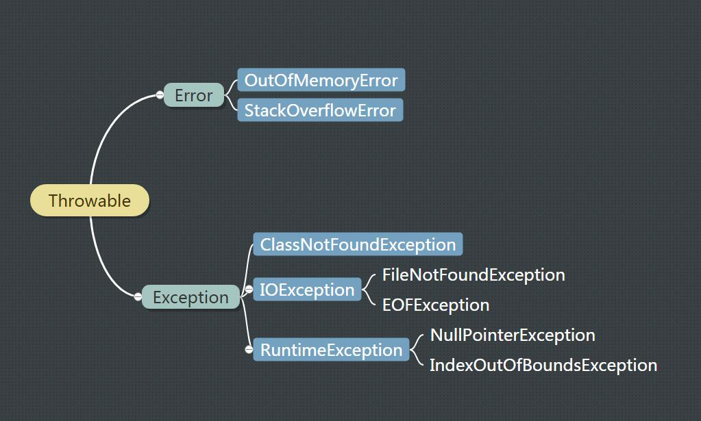

### 异常及其分类

---



#### 继承关系

+ Throwable：一个类，实现了 Serializable 接口。有 Error 和 Exception 两个重要的子类。

+ Error （错误）：是程序无法处理的错误，表示运行应用程序中较严重问题。

+ Exception（异常）：是程序本身可以处理的异常。
  
Exception 类有一个重要的子类 RuntimeException。RuntimeException 类及其子类表示「 JVM 常用操作」引发的错误。例如，若试图使用空值对象引用、除数为零或数组越界，则分别引发运行时异常 NullPointerException、ArithmeticException 和 ArrayIndexOutOfBoundException。

异常和错误的区别：异常能被程序本身可以处理，错误是无法处理。

#### 异常的分类

Java的异常通常分为可查的异常（checked exceptions）和不可查的异常（unchecked exceptions）。

+ 可查异常：编译器要求必须处置的异常。除了RuntimeException 及其子类的异常。

  这种异常的特点是 java 编译器会检查它，也就是说，当程序中可能出现这类异常，要么用try-catch语句捕获它，要么用throws子句声明抛出它，否则编译不会通过。

+ 不可查异常：编译器不要求强制处置的异常。包括运行时异常（RuntimeException）及其子类。

  这种都是 RuntimeException 类及其子类，如 NullPointerException 等，这些异常是不检查异常，程序中可以选择捕获处理，也可以不处理。

#### 异常处理机制

在 java 应用程序中，异常处理机制为：抛出异常，捕捉异常。

+ 抛出异常：当一个方法出现错误引发异常时，方法创建异常对象并交付运行时系统，异常对象中包含了异常类型和异常出现时的程序状态等异常信息。运行时系统负责寻找处置异常的代码并执行。

  通过 java 的 throw,throws 关键字抛出异常。

+ 捕获异常：在方法抛出异常之后，运行时系统将转为寻找合适的异常处理器（exception handler）。潜在的异常处理器是异常发生时依次存留在调用栈中的方法的集合。当异常处理器所能处理的异常类型与方法抛出的异常类型相符时，即为合适的异常处理器。运行时系统从发生异常的方法开始，依次回查调用栈中的方法，直至找到含有合适异常处理器的方法并执行。当运行时系统遍历调用栈而未找到合适的异常处理器，则运行时系统终止。同时，意味着 java 程序的终止。

  通过 try-catch 语句结构或者 try-catch-finally 语句结构捕捉异常。

##### 捕获异常

###### try-catch 语句结构

``` java
try {  
    // 可能会发生异常的程序代码  
} catch (Type1 id1){  
    // 捕获并处置 try 抛出的异常类型 Type1  
}  
catch (Type2 id2){  
    // 捕获并处置 try 抛出的异常类型 Type2  
} 
```

匹配的原则：如果抛出的异常对象属于 catch 子句的异常类，或者属于该异常类的子类，则认为生成的异常对象与catch块捕获的异常类型相匹配。

一旦某个 catch 捕获到匹配的异常类型，将进入异常处理代码。一经处理结束，就意味着整个 try-catch 语句结束，其他的catch子句不再有匹配和捕获异常类型的机会。

对于有多个 catch 子句的异常程序而言，应该尽量将子类异常的 catch子句放在前面，同时尽量将相对高层的异常类的 catch 子句放在后面。否则，捕获子类异常类的 catch 子句将会被屏蔽，造成编译错误。

例如：RuntimeException 异常类包括运行时各种常见的异常，ArithmeticException 类和 ArrayIndexOutOfBoundsException 类都是它的子类。因此，RuntimeException 异常类的 catch 子句应该放在最后面，否则可能会屏蔽其后的特定异常处理并造成编译错误。


###### try-catch-finally 语句

``` java
try {  
    // 可能会发生异常的程序代码  
} catch (Type1 id1) {  
    // 捕获并处理 try 抛出的异常类型 Type1  
} catch (Type2 id2) {  
    // 捕获并处理 try 抛出的异常类型 Type2  
} finally {  
    // 无论是否发生异常，都将执行的语句块
}
// do something
```

无论是否捕获异常，finally 块里的语句都会被执行。当在 try 块或 catch 块中遇到 return 语句时，finally 语句块将在方法返回之前被执行。在以下 4 种特殊情况下，finally块不会被执行：

1. 在 finally 语句块中发生了异常。

2. 在前面的代码中用了 System.exit() 退出程序。

3. 程序所在的线程死亡。

4. 关闭CPU。


###### try-catch-finally 语句的各种情况

1. 没有发生异常。

  执行除了 catch 以外的全部内容。

2. 发生异常

   1. 没有 catch 语句捕获，或者 catch 中发生异常。
      先执行 finally 中的语句，然后向上抛出给它的调用者，不会执行 finally 之后的语句。
     
   2. 有 catch 语句捕获，并且处理成功。
      先执行 finally 中的语句，然后继续执行 finally 之后的语句。

3. finally 中有 return/throw 的情况。这是个十分极端的情况，应该没什么实用性。

   由于 throw Exception() 和 return 都是结束类语句，而 finally 块中的语句总是要在这些结束类语句执行之前执行，所以如果 finally 块中也有这两种结束类语句，则 try/catch 中的这两种语句就会无效！！

   通常在 try/catch 返回之前，都会先缓存一下结果（即使 finally 中修改了要返回的变量值，也不会影响缓存的结果），然后在 finally 语句块执行完之后，再把缓存的结果返回给调用者。


